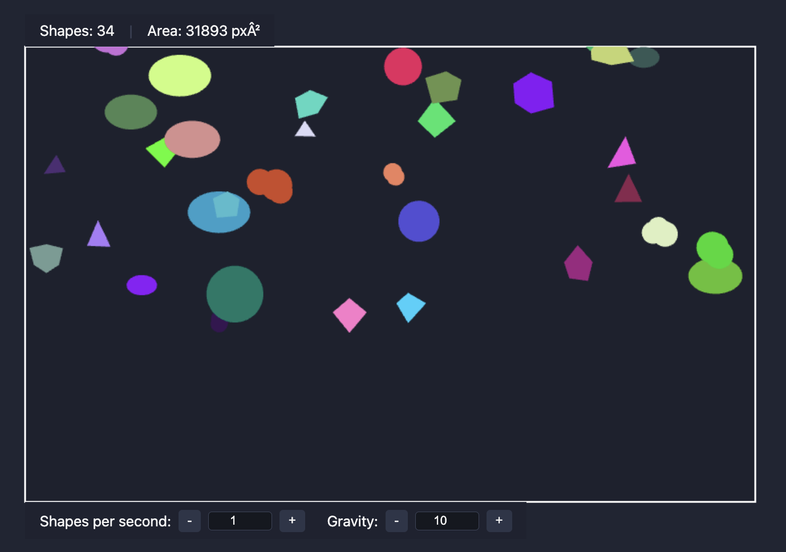
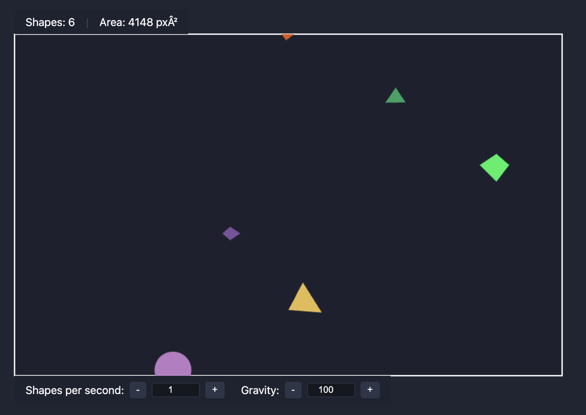
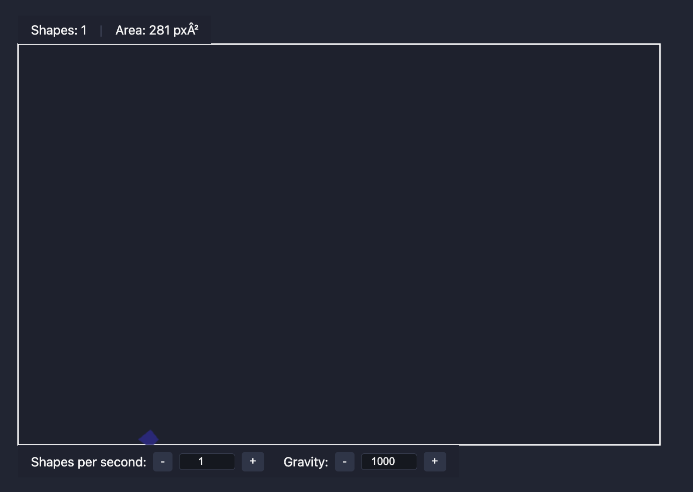
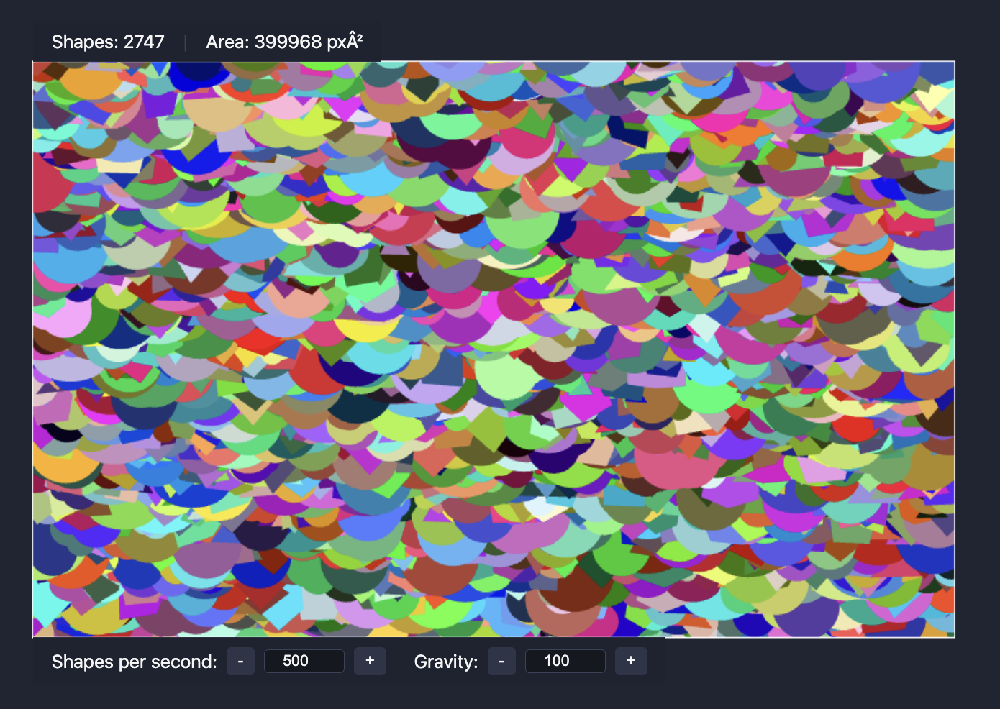
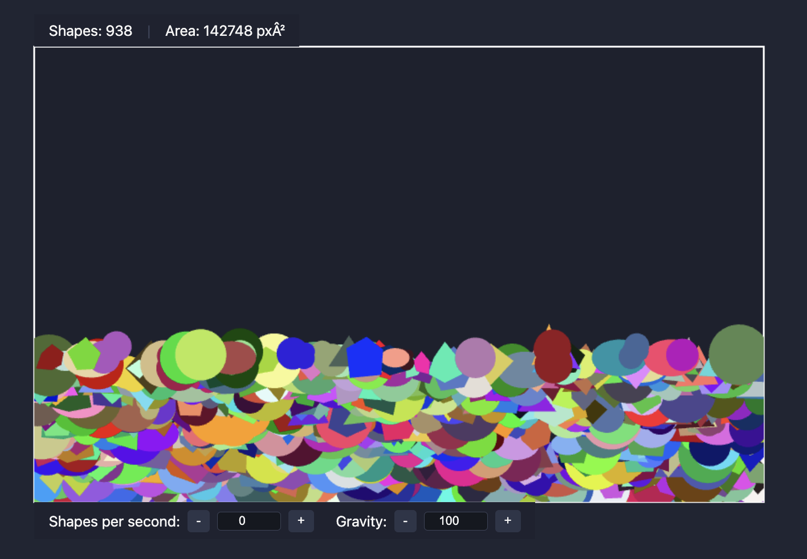

# Pixi.js Falling Shapes Test Assignment

A test assignment project implementing falling shapes using Pixi.js. The application features a rectangular area where randomly generated shapes fall from top to bottom, with interactive controls for shape generation and removal.

## Key Features

- Different shape types, including cloud shape (random)
- Falling shapes with configurable gravity
- Click interactions on the rectangular area
- Rectangle mask for display area boundaries
- Pixel-based area calculation
- Accurate counting of shapes inside the area

## Requirements

- Node.js ≥ 18
- npm ≥ 9

## How to run

```bash
npm install
npm run dev
npm run build
npm run preview
```

## Screenshots











## Notes

The task has been completed according to the technical requirements:

Create a rectangular area.
Inside the rectangular area generate random shapes with random colours.
The shapes must fall down from top to bottom (the generated position is outside the top of the rectangle, the
bottom position is outside the bottom of the rectangle). The falling is controlled by the Gravity Value,
If you click inside the rectangle, a random shape of random colour will be generated at mouse position and start
falling.
If you click a shape, it will disappear
